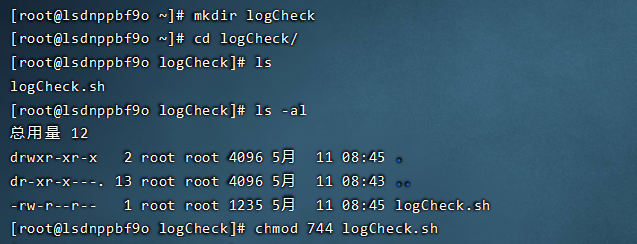
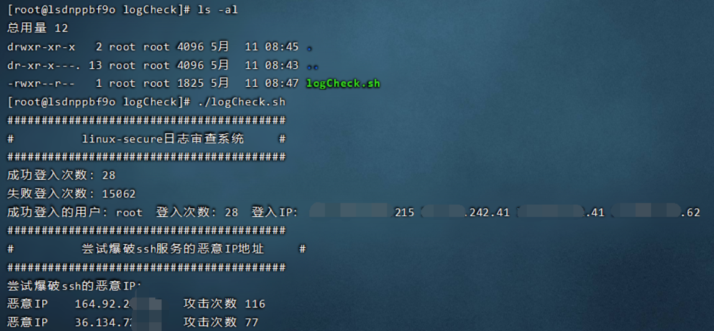
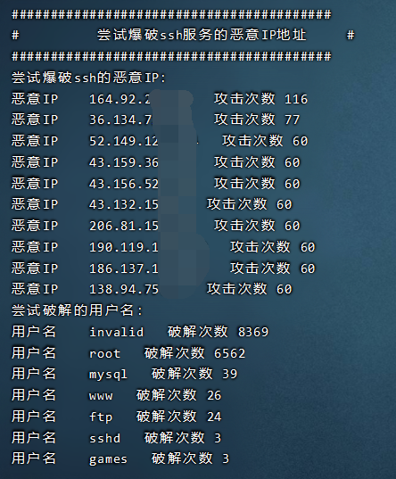
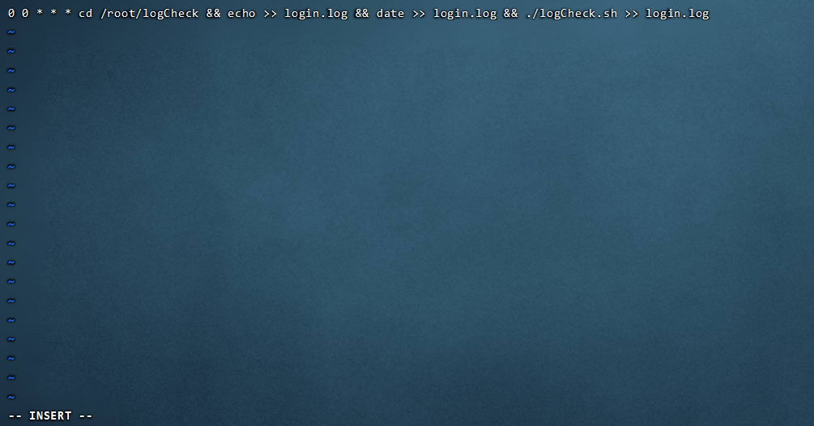
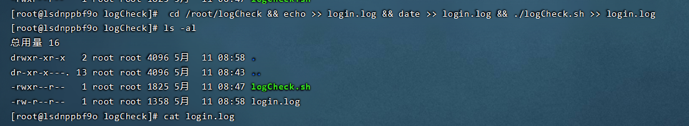
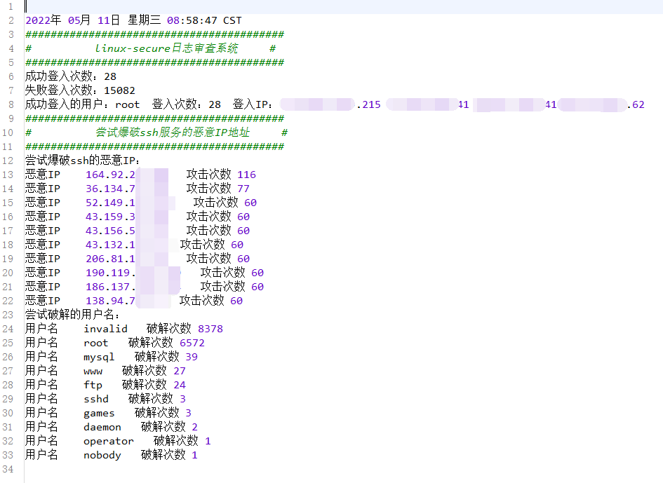

# Linux登入日志管理系统

Shell脚本程序监控程序

主要用于监控 /var/log/secure 登入日志文件，检索成功登入的IP和尝试恶意破解的IP

持续更新~

## 使用说明

首先将shell脚本放入某个目录下，并使用chmod赋权



运行脚本程序



登入IP每个IP表示一个登入地址，下面的按照攻击破解ssh口令的次数排序恶意IP的地址：



### 常态化运维管理

可以使用crontab设置定时任务进行常态化运维管理

```
crontab -e
```

编辑任务如下，每日0点0分时指向命令，这里需要写入你自己服务器的目录

```
cd /root/logCheck && echo >> login.log && date >> login.log && ./logCheck.sh >> login.log
```



执行命令后将在设定目录下生成新的日志文件



通过检索日志文件可以快速锁定恶意IP，并检查服务器是否被破解

