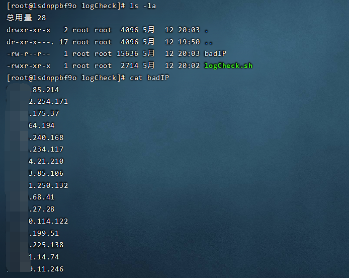

# Linux登入日志管理系统

Shell脚本程序监控程序

主要用于监控 /var/log/secure 登入日志文件，检索成功登入的IP和尝试恶意破解的IP

持续更新~

2022/5/12 更新 SSH破解检测，检测成功破解SSH服务的恶意IP信息

## 使用说明

首先将shell脚本放入某个目录下，并使用chmod赋权


运行脚本程序，可以看到破解次数前5的恶意IP和用户名，若服务器被成功破解，则显示成功破解信息，这里需要审查恶意IP是否为合法的用户


程序运行后会在当前目录下生成恶意IP列表 badIP文件，按照破解次数降序排序



查看SSH黑名单配置文件


如果有需要可以加入SSH黑名单来禁止这些IP访问SSH，建议先备份


### 常态化运维管理

可以使用crontab设置定时任务进行常态化运维管理

```
crontab -e
```

编辑任务如下，每日0点0分时指向命令，这里需要写入你自己服务器的目录

```
cd /root/logCheck && echo >> login.log && date >> login.log && ./logCheck.sh >> login.log
```


执行命令后将在设定目录下生成新的日志文件


通过检索日志文件可以快速锁定恶意IP，并检查服务器是否被破解

